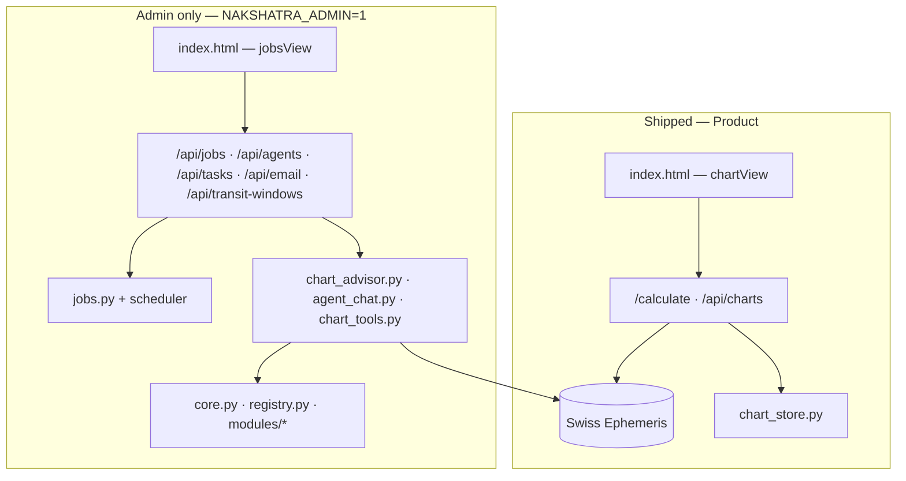

# Architecture — Product vs Admin

Nakshatra Chakram is split into a **shipped product surface** (Chart) and an **admin-only operator console** (Jobs & Agents). The second top-level tab does **not** ship to end users.

**Related:** [ROADMAP.md](ROADMAP.md) · [SHIP_STRATEGY.md](SHIP_STRATEGY.md)

*Last updated: 2026-06-04*

---

## 1. Top-level UI map

```text
┌─────────────────────────────────────────────────────────────┐
│  Nakshatra Chakram                                          │
├─────────────────────────────────────────────────────────────┤
│  [ ✦ Chart ]     [ ⚙ Jobs & Agents ]  ← ADMIN ONLY (dev)   │
├─────────────────────────────────────────────────────────────┤
│  CHART (ships)                                              │
│    Birth form · saved charts · calculate                     │
│    Summary · Ashtakavarga · Shadbala                        │
│    Tabs: Wheel | Dasha | Yogas | Gochara                     │
├─────────────────────────────────────────────────────────────┤
│  JOBS & AGENTS (does not ship)                              │
│    Watch profile · SMTP · scheduled jobs · run history      │
│    Chart advisor chat · transit windows (scheduler context) │
└─────────────────────────────────────────────────────────────┘
```

| Surface | Tab / entry | Ships? | Audience |
|---------|-------------|--------|----------|
| **Product** | `✦ Chart` | **Yes** | All users (free / Plus / FOSS) |
| **Admin** | `⚙ Jobs & Agents` | **No** | Operator / developer only |

Default install: **Chart tab only** (`NAKSHATRA_ADMIN=0`).

---

## 2. Layer diagram



**Rule:** Product code may import `calculator` and `chart_store`. Admin code imports `jobs`, `agents`, `chart_advisor`, and automation `core` — never required for a minimal shipped binary.

---

## 3. Module ownership

### Product (ship)

| Module | Responsibility |
|--------|----------------|
| `agent/calculator.py` | Sidereal positions, nakshatra table, vargas, dashas, yogas, gochara, strengths |
| `agent/chart_store.py` | Saved charts (SQLite) |
| `agent/server.py` | `POST /calculate`, chart CRUD, serves `index.html` |
| `agent/static/index.html` | `chartView` + chart sub-tabs |
| `tests/test_calculator.py` | Regression / golden charts |

### Admin (do not ship in consumer builds)

| Module | Responsibility |
|--------|----------------|
| `agent/jobs.py` | APScheduler, gochara_scan, run history, watch profile |
| `agent/agents.py` | Agent registry (chart_advisor) |
| `agent/agent_chat.py` | Chat sessions, profile resolution |
| `agent/chart_advisor.py` | LangChain tool-loop advisor |
| `agent/chart_tools.py` | StructuredTools → calculator |
| `agent/email_service.py` | SMTP alerts for job runs |
| `agent/transit_windows.py` | Long-horizon transit windows (jobs UI) |
| `agent/core.py` | Anthropic automation loop (Gmail, etc.) |
| `agent/registry.py` + `agent/modules/*` | General automation tools |
| `agent/mcp_server.py`, `agent/cli.py`, `agent/interactive.py` | Cursor / CLI operator tools |
| `launcher/` | Cursor SDK bridge |

### Shared infrastructure

| Module | Notes |
|--------|--------|
| `agent/env.py` | Loads `.env`; used by both layers |
| `agent/app_config.py` | `admin_enabled()` flag |
| `agent/data/jobs.db` | Charts + job config (gitignored); product uses chart tables only in ship |

---

## 4. API boundaries

### Product APIs (always on)

| Method | Path | Purpose |
|--------|------|---------|
| `GET` | `/` | Chart UI |
| `POST` | `/calculate` | Full chart computation |
| `GET/POST/PATCH/DELETE` | `/api/charts` … | Saved chart library |
| `GET` | `/transit_positions` | Optional transit lookup |
| `GET` | `/api/places` | Offline place autocomplete |

### Admin APIs (`NAKSHATRA_ADMIN=1` only; else **404**)

| Prefix | Purpose |
|--------|---------|
| `/api/jobs` | Scheduler, runs, watch profile |
| `/api/agents` | Chart advisor chat |
| `/api/tasks` | Unified task enable/run |
| `/api/email` | SMTP settings for job alerts |
| `/api/transit-windows` | Upcoming windows (jobs dashboard) |

`GET /api/app-config` is always available: `{ "admin_enabled": bool, "product_surface": "chart" }`.

---

## 5. Runtime flags

| Variable | Default | Effect |
|----------|---------|--------|
| `NAKSHATRA_ADMIN` | `0` / unset | **Ship mode:** hide Jobs tab, disable admin APIs, no scheduler |
| `NAKSHATRA_ADMIN` | `1` | **Dev/ops mode:** full Jobs & Agents UI and background jobs |
| `NAKSHATRA_ALLOW_ONLINE_GEOCODE` | unset | **Offline geocode** (bundled `places.json` + lat,lon) |
| `NAKSHATRA_ALLOW_ONLINE_GEOCODE` | `1` | Optional Nominatim fallback for unknown places |

```bash
# Shipped / end-user run (fully local chart product)
python -m agent.server

# Local operator (you)
NAKSHATRA_ADMIN=1 python -m agent.server
```

**Fully local chart path:** no admin flag, no online geocode, no LLM keys — ephemeris + offline places + SQLite charts + bundled UI fonts only. No webhooks. No `fonts.googleapis.com` requests.

---

## 6. Shipping implications

| Topic | Product | Admin |
|-------|---------|-------|
| [SHIP_STRATEGY](SHIP_STRATEGY.md) Path A/B | Chart features only | Not marketed |
| FOSS repo | Include `calculator`, UI chart half | `jobs`/advisor optional in repo but **off by default** |
| Plus / paid tier | Wheel, vargas, exports | No “Jobs” upsell |
| AI | Future: BYOK in Chart tab (product) | Today: advisor lives in admin tab only |
| Dependencies | FastAPI, pyswisseph, geopy | + LangChain, Anthropic, Google APIs for admin |

**Future product AI:** Move a slim advisor into Chart (BYOK) without pulling in `jobs.py` or scheduler.

---

## 7. Build / packaging checklist (release)

See **[PUBLIC_RELEASE.md](PUBLIC_RELEASE.md)** for releases, Pages, and `docs/downloads/`.

- [ ] `./scripts/package_desktop.sh <version>` → upload zip to public `nakshatra` repo
- [ ] Update `docs/site.json` download URLs; deploy `docs/` to Pages (public repo)
- [ ] `NAKSHATRA_ADMIN` not set in packaged `run-*.command` / `.bat` (shipped default)
- [ ] Smoke test with admin **off**: no Jobs tab, `/api/jobs` returns 404
- [ ] Document operator setup in README (admin flag for maintainers only)
- [ ] Optional: separate `requirements-admin.txt` for LangChain + Google (product `requirements.txt` stays lean)

---

## 8. Refinement log

| Date | Change |
|------|--------|
| 2026-06-04 | Documented product vs admin split; Jobs & Agents tab admin-only, non-shipping. Added `app_config.py`, API middleware, UI gating. |